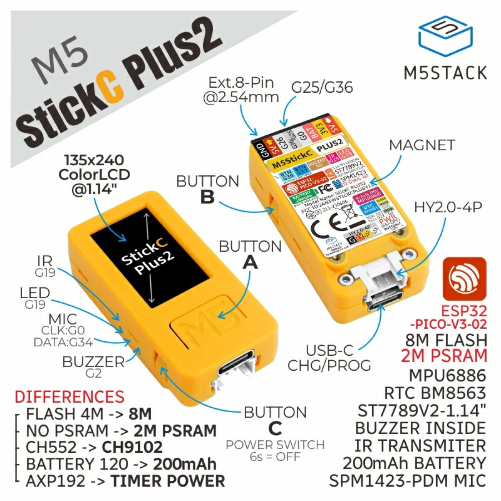
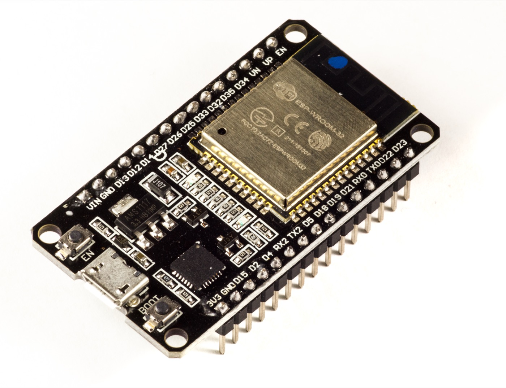
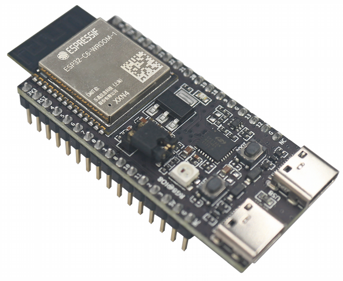

# Example projects for using iroh on an ESP32

This repository contains several completely separate Rust projects (no Cargo
workspace). Each is one **server** variant — an iroh echo endpoint for a specific
ESP32 — plus two **clients** to dial them.

## Servers (one per hardware variant)

Each keeps the largest configuration that runs *reliably* on that board:

- [`server-esp32-psram/`](server-esp32-psram/README.md) — ESP32-WROVER / M5StickC
  (LX6) **with PSRAM**. Enough RAM for **relay + pkarr discovery** (custom iroh
  branch).
- [`server-esp32-s3-psram/`](server-esp32-s3-psram/README.md) — ESP32-S3
  **with PSRAM**. Also gets **relay + pkarr discovery** (same full build, S3
  hardware).
- [`server-esp32/`](server-esp32/README.md) — bare ESP32 (LX6),
  no PSRAM. LAN-direct echo (relay doesn't fit without PSRAM).
- [`server-esp32-s3/`](server-esp32-s3/README.md) — ESP32-S3, no PSRAM. LAN-direct.
- [`server-esp32-c6/`](server-esp32-c6/README.md) — ESP32-C6, the **RISC-V** variant
  (`riscv32imac-esp-espidf`), no PSRAM. LAN-direct.
- [`server-esp32-c61-psram/`](server-esp32-c61-psram/README.md) — ESP32-C61, the
  **RISC-V + PSRAM** variant (2 MB). Runs the **full relay + pkarr discovery** build
  (dialable across networks), tuned to fit the C61's tighter internal SRAM — small
  buffers + a 96 KB stack (see its README). Needs newer tooling (ESP-IDF v5.5.2+,
  esp-idf-svc 0.52, espflash 4.4).

## Clients

- [`client/`](client/README.md) — desktop CLI client (stock crates.io iroh + `ring`).
- [`wasm-gui/`](wasm-gui/README.md) — browser echo client (Rust → WebAssembly).
  Relay-only, so it talks to a PSRAM server (`server-esp32-psram` or
  `server-esp32-s3-psram`).

Each directory has its own `Cargo.toml`, lockfile, and README with build/run
instructions.

## Hardware variants

|  |  |  |  |  |
| :---: | :---: | :---: | :---: | :---: |
| **M5StickC PLUS2 / ESP32-WROVER** (LX6, with PSRAM) | **ESP32-S3** (with PSRAM) | **Bare ESP32** (LX6) (no PSRAM) | **Bare ESP32-S3** (no PSRAM) | **ESP32-C6** (RISC-V, no PSRAM) |
| [`server-esp32-psram/`](server-esp32-psram/README.md) | [`server-esp32-s3-psram/`](server-esp32-s3-psram/README.md) | [`server-esp32/`](server-esp32/README.md) | [`server-esp32-s3/`](server-esp32-s3/README.md) | [`server-esp32-c6/`](server-esp32-c6/README.md) |

## Which server variant?

- LX6 board with PSRAM (ESP32-WROVER, M5StickC PLUS2)? Use
  [`server-esp32-psram/`](server-esp32-psram/README.md) — relay + discovery
  (internet-wide reachability).
- ESP32-S3 with PSRAM? Use
  [`server-esp32-s3-psram/`](server-esp32-s3-psram/README.md) — the same full
  relay + discovery build on S3 hardware.
- Bare ESP32 (LX6)? Use [`server-esp32/`](server-esp32/README.md).
- Bare ESP32-S3? Use [`server-esp32-s3/`](server-esp32-s3/README.md).
- ESP32-C6 (RISC-V)? Use [`server-esp32-c6/`](server-esp32-c6/README.md).

The no-PSRAM boards are **LAN-direct only**: dial them with the long ticket (which
carries the IP), from the same network. Relay and pkarr discovery need the RAM
headroom that only PSRAM provides — see the PSRAM variants.

Run the [`client/`](client/README.md) on a desktop to dial whichever server you
flashed (or the [`wasm-gui/`](wasm-gui/README.md) in a browser, against the PSRAM
server).

## Limitations

There are a very large number of ESP32 variants out there. We tried to cover the most important variants in the server projects. Here is some general advice to get iroh to run on *your* board.

We do support both CPU architectures, XTensa for ESP32 and ESP32-S3, RISC-V for ESP32-C* and ESP32-P*. For Xtensa you will need a special tool chain, RISC-V is supported out of the box by rust.

### Flash size

If your board has a flash memory size of less than 8 MiB, you will need a special branch of iroh with reduced dependencies for now.

### PSRAM

If your board does not come with PSRAM, you will need to disable the relay connection and can only dial the endpoint with long tickets containing an IP address. You will also need to tweak QUIC buffers.