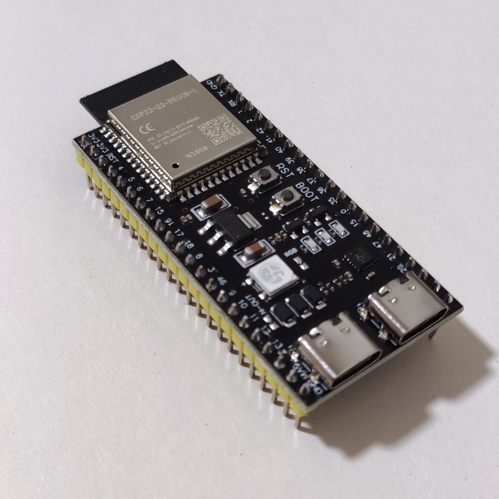

# iroh on ESP32-S3 (without SPIRAM)



An iroh endpoint running on an ESP32-S3 **without** SPIRAM. It is tuned to keep the
memory footprint low — smaller buffers and avoiding allocations — so that it
fits in the on-chip RAM.

It targets `xtensa-esp32s3-espidf` (ESP32-S3) by default and depends on the
`esp32-no-spiram` iroh branch. The `alloc_log` module helps track allocations
while keeping the footprint down.

## Build / run

An ESP32 device must be connected over USB-C while running the server. Flashing
and the serial monitor are handled by `espflash` (configured as the cargo
runner in `.cargo/config.toml`).

```bash
WIFI_CONFIG='SSID:PASSWORD' cargo run --release
```

`WIFI_CONFIG` is read at build time and embedded into the firmware; it is the
SSID and password of the WiFi network the device should join, separated by a
colon.

On startup the device prints an endpoint ticket to the serial monitor. Pass
that ticket to the [`client`](../client/README.md) to dial it.

## Targeting a plain ESP32 (LX6) without SPIRAM

For a plain ESP32 (LX6) without SPIRAM, use the dedicated
[`esp32-no-spiram`](../esp32-no-spiram/README.md) project — it is this same
code already retargeted (`target = "xtensa-esp32-espidf"`, `MCU = "esp32"`).
